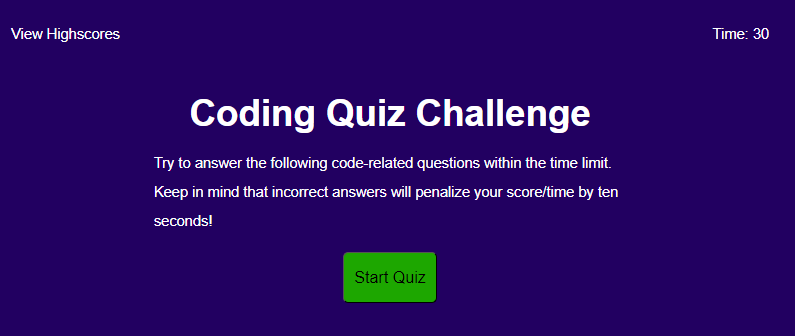

# JavaScript Coding Quiz

## Table of Contents
- [Description](#description)
- [What was learned?](#what-was-learned)
- [Website](#website)
- [Credits](#credits)
 

## Description
This is an interactive coding quiz created using JavaScript, HTML and CSS. It features 5 multiple-choice questions and logs your score. At the end you have the option to put in your initials and also view the highscores.
 

## What was learned?
While working on this project I learned how to use click events and create functions to edit the html for the user in live time. I also learned how to effectively use queryselectors and how to traverse the DOM.

 

## Website
[The link to the deployed webpage can be found here](https://angadbatth.github.io/js-coding-quiz/)

 

## Credits

[Mozilla Developer](https://developer.mozilla.org/en-US/)  
[W3 Schools](https://www.w3schools.com/)  
[Stack Overflow](https://stackoverflow.com/)  
Daler Singh  
Adam Nyx
